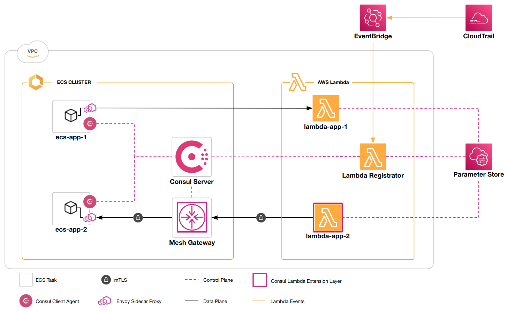

# Consul and AWS Lambda Integration

This example demonstrates how to integrate AWS Lambda functions with your Consul service mesh.



The example environment consists of the following components:
- A Consul development cluster deployed to ECS, along with a mesh gateway, and two services ( `ecs-app-1` and `ecs-app-2`).
- `consul-lambda-registrator` is configured to manage Lambda functions within the mesh:
  - AWS EventBridge is configured to invoke `consul-lambda-registrator` periodically to perform a full synchronization of AWS Lambda state with Consul.
  - AWS EventBridge is configured to monitor Lambda events from CloudTrail to synchronize the state of individual AWS Lambda functions with Consul, when their state changes.
  - `consul-lambda-registrator` stores the required mTLS material in AWS Systems Manager Parameter Store.
- `lambda-app-1` is a Lambda function that accepts incoming requests from the `ecs-app-1` service.
- `lambda-app-2` is a Lambda function that makes outgoing requests to the `ecs-app-2` service.
- `consul-lambda-extension` is configured as a Lambda layer. The extension uses the mTLS artifacts from Parameter Store to proxy requests from `lambda-app-2` to the services in the mesh through the mesh gateway.

_Note: The deployment configuration in this example is for demonstration purposes only and should not be considered best practice for production deployments._

_Note: Some of the steps in this example will create AWS resources that may result in charges to your AWS account._

## Prerequisites

In order to run this example you will need the following tools installed:
- Go
- Terraform
- AWS CLI
- Docker
- `curl`
- `jq`

## Set the version

The subsequent steps in the example require a version identifier.
To make the steps repeatable across releases, the target version is set in an environment variable.

```shell
export VERSION=<X.Y.Z>
```

Replace `<X.Y.Z>` with the target version of this repository, for example:

```shell
export VERSION=0.1.0
```

## Get the example code

```shell
git clone https://github.com/hashicorp/terraform-aws-consul-lambda
cd terraform-aws-consul-lambda/examples/lambda
git checkout v${VERSION}
```

## Set your AWS region

Subsequent steps require knowledge of the AWS region that you want to deploy the example resources to.
Export these values to environment variables using the commands below.
Replace  `<region>` with your AWS region.

```shell
export AWS_REGION=<region>
```


## Download the `consul-lambda-extension`

Use the following command to download the `consul-lambda-extension` package.
This example Terraform workspace will use the zip package to deploy the `consul-lambda-extension` as a Lambda layer and
add it to the `lambda-app-2` function so that it can call services within the Consul service mesh.

```shell
curl -o consul-lambda-extension.zip "https://releases.hashicorp.com/consul-lambda-extension/${VERSION}-beta4/consul-lambda-extension_${VERSION}-beta4_linux_amd64.zip"
```

## Build the example Lambda function

This step builds and packages the function that will be deployed to AWS Lambda.
This Lambda function is used as the source for both `lambda-app-1` and `lambda-app-2`.

```shell
(cd src/lambda && GOOS=linux GOARCH=amd64 CGO_ENABLED=0 go build -o main && zip function.zip main)
```

## Get your IP address

This ensures that only your IP address has access to the public facing ingress points.

```shell
export MY_IP="$(curl -sS ifconfig.me)/32"
```

## Deploy the example using Terraform

Apply the Terraform workspace to deploy the Consul service mesh to AWS ECS and Lambda.

```shell
terraform init
terraform apply \
  -var "name=${USER}" \
  -var "region=${AWS_REGION}" \
  -var "ingress_cidrs=[\"${MY_IP}\"]"
```

Answer `yes` when prompted to perform the action. The apply will take several minutes to complete.

## Consul UI

Copy the address for the `consul_ui` from the `terraform output` and paste it into a web browser to navigate to the Consul UI.


The UI displays the list of registered services including the two Lambda functions, `lambda-app-1` and `lambda-app-2`.

## Invoke a Lambda function from a service

The `ecs-app-1` service is configured to call `lambda-app-1` as its upstream.
When everything is working correctly `ecs-app-1` will get a `200 OK` response from `lambda-app-1`.

Copy the address for the `ecs_app_1_ui` from the `terraform output` and paste it into a web browser to navigate to the application's web UI.


The UI for `ecs-app-1` displays the response for the `lambda-app-1` upstream, which is bound to `http://localhost:1234`.

You can use `curl` to directly call `ecs-app-1` and get the detailed output of the upstream request.
_Note: remember to remove the trailing `/ui` from the request path in the `curl` command._

```shell
curl http://example-ecs-app-1-1807159075.us-west-2.elb.amazonaws.com:9090
{
  "name": "example-ecs-app-1",
  "uri": "/",
  "type": "HTTP",
  "ip_addresses": [
    "169.254.172.2",
    "10.0.2.126"
  ],
  "start_time": "2022-09-22T20:21:16.681911",
  "end_time": "2022-09-22T20:21:16.725064",
  "duration": "43.152579ms",
  "body": "Hello World",
  "upstream_calls": {
    "http://localhost:1234": {
      "uri": "http://localhost:1234",
      "headers": {
        "Content-Length": "28",
        "Content-Type": "application/json",
        "Date": "Thu, 22 Sep 2022 20:21:16 GMT",
        "Server": "envoy",
        "X-Amz-Executed-Version": "$LATEST",
        "X-Amzn-Remapped-Content-Length": "0",
        "X-Amzn-Requestid": "9fab101c-600e-4c01-905c-4378f16bbb70",
        "X-Amzn-Trace-Id": "root=1-632cc3bc-60d3bb46283d939964ed5a10;sampled=0",
        "X-Envoy-Upstream-Service-Time": "39"
      },
      "body": {},
      "code": 200
    }
  },
  "code": 200
}
```

## Call a service from a Lambda function

The `lambda-app-2` function is configured to call the `ecs-app-2` service.
The `consul-lambda-extension` is a layer in the `lambda-app-2` function and it upgrades the function's outgoing
requests to mTLS and proxies them through the mesh-gateway.

Use the following command to invoke the `lambda-app-2` function from the `aws` CLI.

```
aws lambda invoke \
  --region ${AWS_REGION} \
  --function-name ${USER}-lambda-app-2 \
  --payload "$(echo '{"lambda-to-mesh":true}' | base64)" \
  /dev/stdout | jq .
{
  "body": [
    {
      "name": "http://localhost:1234",
      "body": {
        "body": "Hello World",
        "code": 200,
        "duration": "315.409µs",
        "end_time": "2022-09-22T20:34:55.436479",
        "ip_addresses": [
          "169.254.172.2",
          "10.0.2.171"
        ],
        "name": "example-ecs-app-2",
        "start_time": "2022-09-22T20:34:55.436164",
        "type": "HTTP",
        "uri": "/"
      },
      "code": 200
    }
  ],
  "statusCode": 200
}
{
  "StatusCode": 200,
  "ExecutedVersion": "$LATEST"
}
```

The first JSON object is the response from the `lambda-app-2` function.
The `body` includes the response from the upstream `ecs-app-2` service.

The second JSON object is the output of the `aws lambda` command.

## Clean up

Once you've finished with the example make sure to clean up the resources you created!

Use the following command to clean up the resources managed by Terraform.

```shell
terraform destroy \
  -var "name=${USER}" \
  -var "region=${AWS_REGION}" \
  -var "ingress_cidrs=[\"${MY_IP}\"]"
```

Answer `yes` when prompted to perform the action. The destroy can take more than 20 minutes to complete.

Use the following command to delete the private ECR repository.

```shell
aws ecr delete-repository --repository-name consul-lambda-registrator --force --region ${AWS_REGION}
```

## Next steps

See our [full documentation](https://www.consul.io/docs/lambda) when you're ready to deploy your own AWS Lambda functions
into the service mesh.
